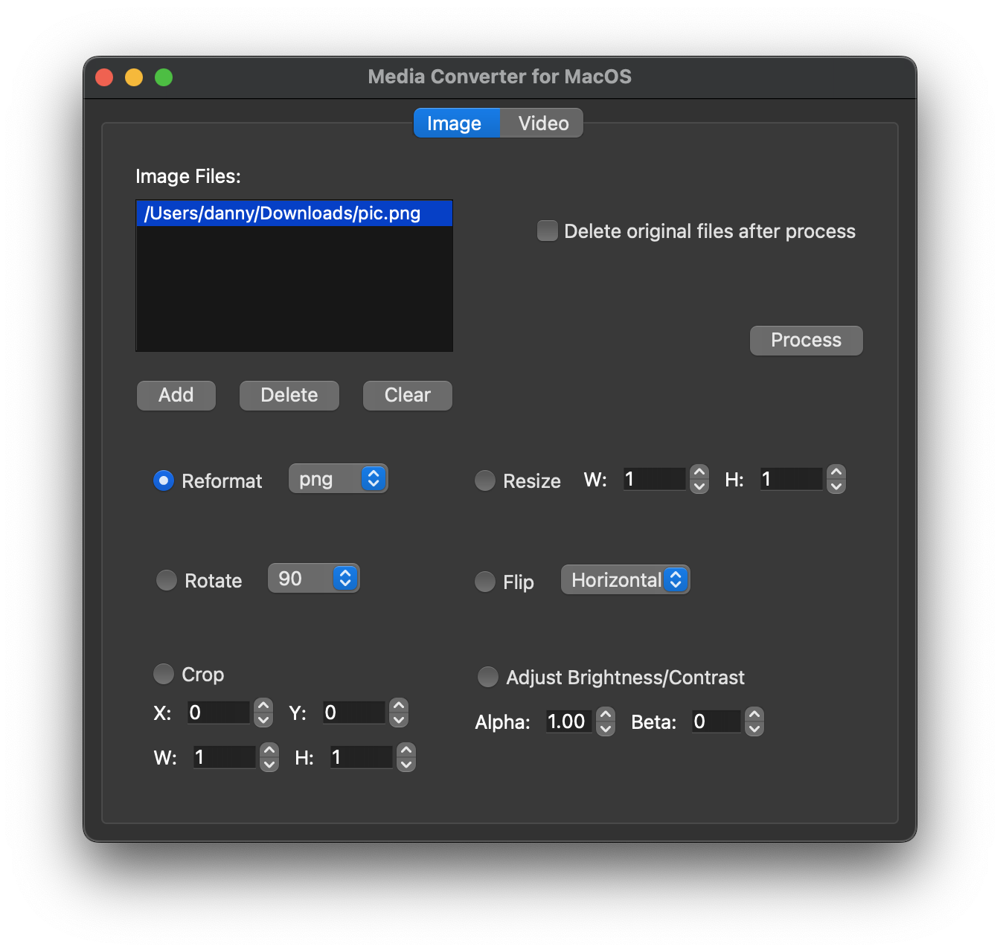

# MediaConv

MediaConv is a media converter application designed for macOS on Apple Silicon.  
It provides a user-friendly interface for quick processing of both images and videos, supporting common conversion and editing operations.

---

### How to use

#### Installation

1. Download the latest release from the [GitHub Releases](https://github.com/Hmc-1209/MediaConv-mac/releases/tag/v1.0.0) page.
2. Open the `.dmg` file.
3. Drag `MediaConv.app` into your `Applications` folder.

> **Note:** MediaConv includes all required dependencies and a bundled `ffmpeg` executable.

---

### What can this application do:

#### Image Processing
- Reformat image files to various formats (PNG, JPG, BMP, TIFF, WEBP)
- Resize images
- Crop images
- Rotate images (90°, 180°, 270°)
- Flip images (horizontal / vertical)
- Adjust brightness & contrast

#### Video Processing
- Reformat video files (MP4, MKV, AVI, etc.)
- Resize videos
- Crop videos
- Rotate videos (90°, 180°, 270°)
- Flip videos (horizontal / vertical)
- Adjust brightness

---

### Usage

1. Launch MediaConv from your Applications folder.
2. Select either the **Image** or **Video** tab.
3. Add files via the "Add" button.
4. Select desired operations (Reformat, Resize, Crop, Rotate, Flip, Adjust).
5. Configure parameters for each operation as needed.
6. Choose an output directory and whether to delete original files.
7. Click **Process** to start processing.

---

## Notes

- MediaConv is optimized for **batch processing**, making it suitable for handling multiple files quickly.
- The interface is designed for speed and efficiency; detailed previews of individual edits are not provided.
- Supports common image and video formats, but not every possible codec is guaranteed.

---

### License

This project is released under the [MIT License](LICENSE).

---

### Contact

For any questions or feedback regarding MediaConv, please feel free to get in touch with me.
